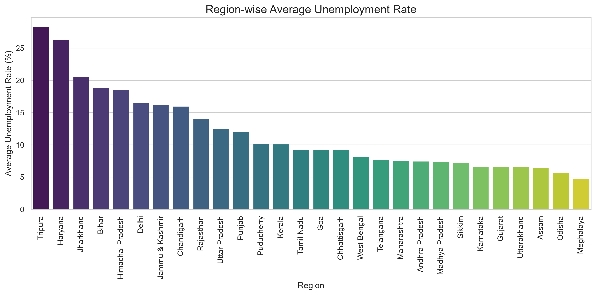
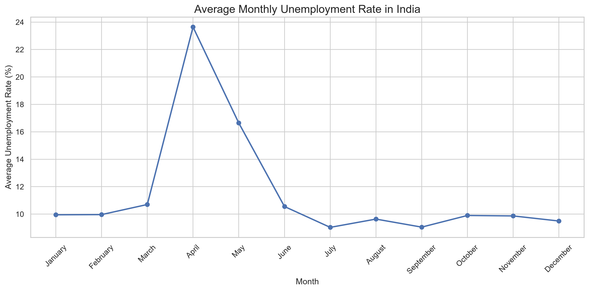
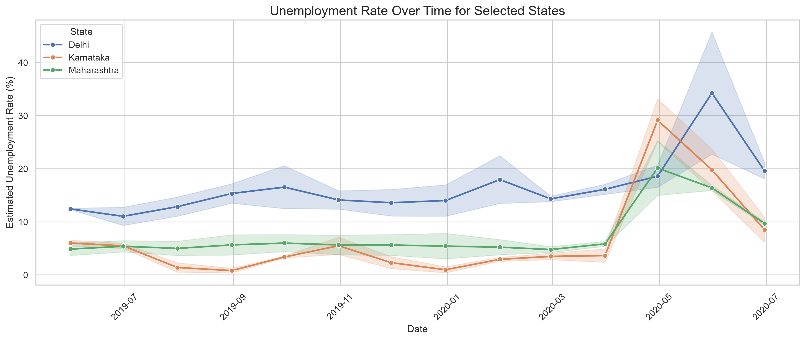
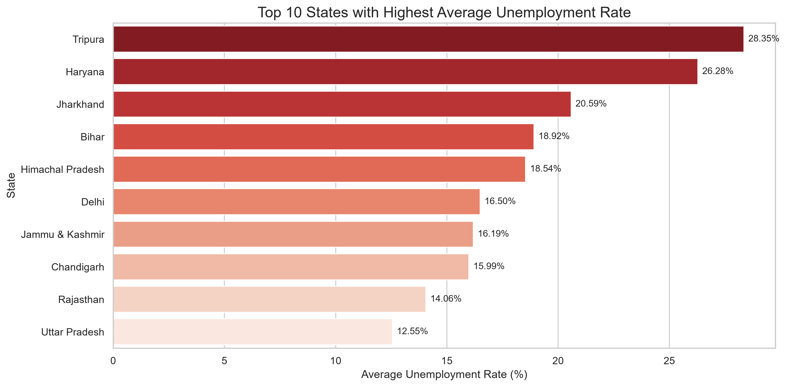
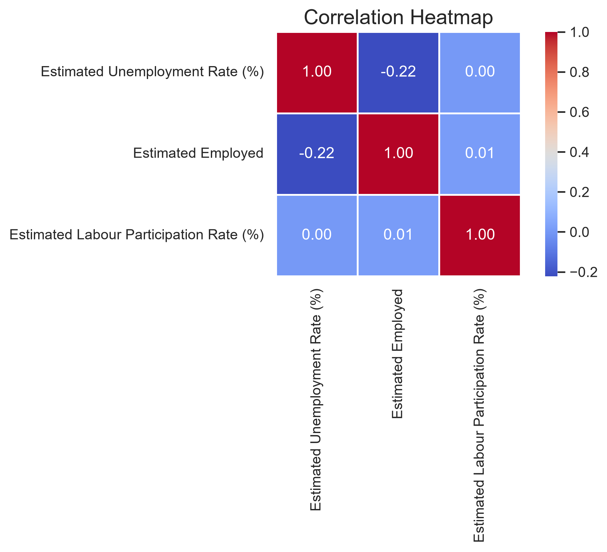
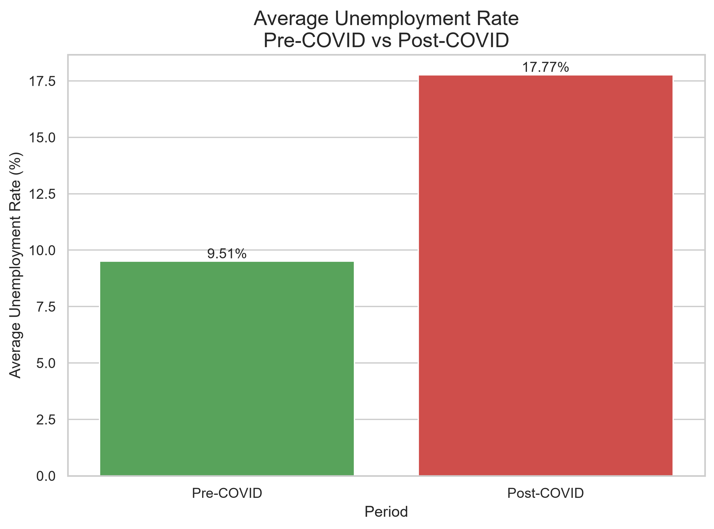

# 📊 Unemployment Analysis with Python

### Oasis Infobyte Internship – Data Science

---

## 📌 Project Overview

This project analyzes unemployment trends in India using Python. The objective is to perform Exploratory Data Analysis (EDA) on unemployment data and understand regional and temporal patterns, with special focus on the impact of the COVID-19 pandemic.

The analysis includes data cleaning, visualization, time-series analysis, correlation analysis, and comparison of unemployment rates before and after COVID-19.

---

## 🎯 Objectives

- Load and clean the unemployment dataset.
- Analyze unemployment trends across different regions.
- Study monthly unemployment patterns.
- Compare unemployment rates among major Indian states.
- Identify the top 10 states with the highest average unemployment.
- Analyze correlations between unemployment rate, employment, and labour participation.
- Compare unemployment before and after the COVID-19 pandemic.

---

## 📂 Dataset

**Dataset Name**

Unemployment in India

Source:
Kaggle – Unemployment in India Dataset

---

## 🛠 Technologies Used

- Python
- Pandas
- NumPy
- Matplotlib
- Seaborn
- Jupyter Notebook

---

# 📁 Project Structure

```
DataScience-Task2-UnemploymentAnalysis/
│
├── outputs/
│   ├── region_wise_average_unemployment.png
│   ├── monthly_unemployment_trend.png
│   ├── state_time_series.png
│   ├── top10_highest_unemployment_states.png
│   ├── correlation_heatmap.png
│   └── covid_pre_vs_post_comparison.png
│
├── unemployment.csv
├── DataScience-Task2-UnemploymentAnalysis.ipynb
├── DataScience-Task2-UnemploymentAnalysis.py
├── README.md
└── requirements.txt
```

---

# 📊 Project Workflow

- Import Libraries
- Load Dataset
- Data Inspection
- Data Cleaning
- Exploratory Data Analysis
- Region-wise Analysis
- Monthly Trend Analysis
- Time Series Analysis
- Top 10 States Analysis
- Correlation Analysis
- COVID-19 Impact Analysis
- Final Conclusion

---

# 📈 Visualizations

## Region-wise Average Unemployment Rate



---

## Monthly Unemployment Trend



---

## Time Series Analysis



---

## Top 10 States with Highest Average Unemployment



---

## Correlation Heatmap



---

## COVID-19 Impact Analysis



---

# 🔍 Key Insights

- Unemployment varies significantly across different regions of India.
- Some states consistently recorded higher unemployment than others.
- COVID-19 caused a noticeable increase in unemployment.
- Labour participation and unemployment exhibit meaningful relationships.
- Time-series analysis highlights regional differences in unemployment trends.

---

# ▶️ How to Run

Clone the repository

```bash
git clone <repository-link>
```

Move into project directory

```bash
cd DataScience-Task2-UnemploymentAnalysis
```

Install dependencies

```bash
pip install -r requirements.txt
```

Run the notebook

```bash
jupyter notebook
```

---

# 📌 Conclusion

This project demonstrates the use of Python for real-world data analysis. Through Exploratory Data Analysis (EDA), various unemployment trends were identified across Indian states, and the impact of the COVID-19 pandemic was analyzed using statistical summaries and visualizations.

The project highlights how data visualization can transform raw datasets into meaningful insights for decision-making.

---

## 👨‍💻 Author

**Shaikh Danish Shaikh Umar Farooq**

**Oasis Infobyte – Data Science Internship**